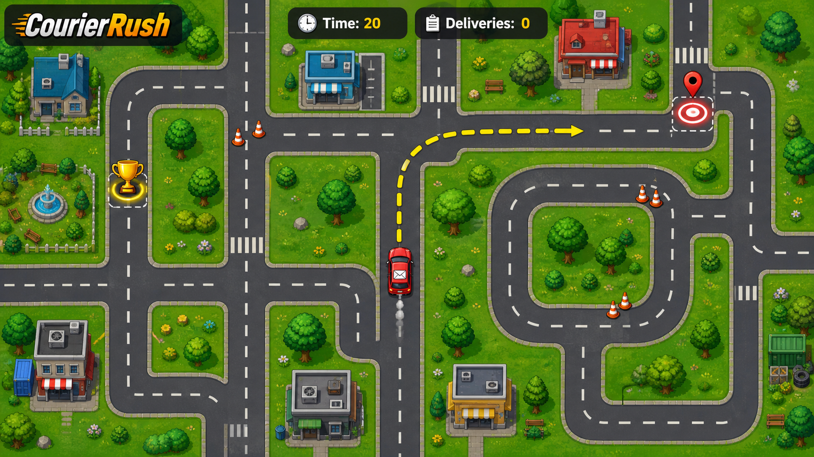

# CourierRush 2D

CourierRush is a top-down 2D Unity driving game about collecting packages and delivering them across an endlessly expanding road network before the timer runs out. The player controls a small courier car, follows an objective arrow, picks up a trophy package, races to a delivery target, avoids cones, and tries to complete as many deliveries as possible.

## Gameplay Overview

The game is built around a fast delivery loop:

1. Drive the courier car through a procedurally generated road grid.
2. Find and collect the package pickup marker, shown with the trophy sprite.
3. After pickup, a delivery timer starts.
4. Follow the arrow toward the delivery target marker.
5. Reach the target before time expires.
6. Score one completed delivery.
7. A new package pickup appears somewhere else on the active road network.
8. Repeat the loop while navigating new roads, intersections, turns, loops, and cone hazards.

The core challenge is route reading. The road network keeps refreshing around the player, so the player must steer cleanly, react to newly spawned road chunks, avoid obstacles, and keep moving toward the current objective before the countdown reaches zero.

## Complete Gameplay Loop

### Car Movement

The car uses a `Rigidbody2D`-based controller in `Assets/Scripts/CarController.cs`.

- `W` / `Up Arrow` accelerates forward.
- `S` / `Down Arrow` brakes and reverses.
- `A` / `Left Arrow` steers left.
- `D` / `Right Arrow` steers right.
- The car has acceleration, deceleration, max speed, and turn speed values.
- Movement is applied in `FixedUpdate`, so the car behaves consistently with Unity physics.
- The car moves along its local `transform.up` direction, giving it a classic top-down driving feel instead of simple grid movement.

### Camera Follow

The camera follows the player car through `Assets/Scripts/CameraFollow.cs`.

- The camera target is the car transform.
- Camera movement runs in `LateUpdate` so it follows after the car moves.
- The camera keeps its own Z position and copies the car's X and Y position.
- This keeps the car centered while the generated world scrolls underneath.

### Road Generation

The road network is generated by `Assets/Scripts/WorldSpawner.cs`.

- The world is divided into square chunks.
- Each chunk is placed on a grid coordinate calculated from the player's world position.
- The spawner keeps a configurable radius of chunks active around the player.
- Chunks outside the active radius are destroyed.
- Missing chunks inside the active radius are spawned.
- Each chunk prefab has `ChunkData` ports that describe which directions its roads connect to: north, south, east, and west.
- When a new chunk is placed, the spawner checks neighboring chunks and chooses a compatible prefab so road exits connect cleanly.
- The result is an infinite-feeling road network made from reusable tilemap chunks such as straight roads, corners, crossroads, loops, T-junctions, and roundabouts.

### Package Pickup

The pickup system is handled by `Assets/Scripts/DeliveryManager.cs`.

- The game starts in the `WaitingForPickup` state.
- A pickup objective is spawned on a valid road tile.
- The pickup uses the trophy sprite.
- The pickup must be far enough away from the player, controlled by `minSpawnDistance`.
- Objective placement scans active chunk tilemaps and chooses from road cells only.
- The objective avoids invalid obstacle positions using an overlap radius check.
- When the player gets within `collectDistance`, the pickup is collected.

### Delivery Targets

After collecting a package, the game switches to the `CarryingPackage` state.

- The delivery timer starts immediately.
- The objective marker changes to the delivery target sprite.
- The target is moved to another valid road position.
- The target is placed on an active road tile and kept away from the player.
- If the objective's chunk unloads because the player drives far away, the current objective respawns on an active road chunk.
- Reaching the target completes the delivery, increments the score, clears the timer, and spawns the next pickup.

### Timer

Deliveries are time-limited.

- The default delivery time limit is `20` seconds.
- The timer displays as `Time: <seconds>` while a package is being carried.
- The timer displays `Time: --` when no delivery is active.
- Time counts down with `Time.deltaTime`.
- If time reaches zero, the delivery fails.
- A failed delivery resets the state back to `WaitingForPickup` and spawns a new pickup.

### Score

The score is a delivery counter.

- The HUD displays `Deliveries: <count>`.
- Each completed target delivery adds one point.
- Failed deliveries do not add score.
- After scoring, the next pickup appears and the loop continues.

### Objective Arrow

The navigation arrow is controlled by `Assets/Scripts/TargetArrow.cs`.

- The arrow references the player transform and the active objective transform.
- Every frame, it calculates the direction from the player to the objective.
- It rotates to point toward the current pickup or delivery target.
- This gives the player a constant navigation hint even when the target is off-screen.

### Obstacles

Cone hazards are spawned by `Assets/Scripts/ConeSpawner.cs`.

- The spawner checks every active road chunk.
- Each chunk can receive a configurable number of cones.
- Cones are placed only on road tile positions.
- Cones are kept away from the player at spawn time.
- Cones are spaced away from each other using `minDistanceBetweenCones`.
- Spawn records are cleared when chunks unload, allowing new chunks to receive hazards as the world refreshes.

### Music and Sound Effects

The project includes a complete audio asset set in `Assets/Audio`.

- `backgroundMusic.mp3` is assigned to the scene's `MusicManager` audio source.
- The music source plays on awake, loops, and uses a reduced volume for background ambience.
- `pickup.ogg` is available for package pickup feedback.
- `success.ogg` is available for successful delivery feedback.
- `bump.ogg` is available for obstacle or collision feedback.
- `click.ogg` is available for UI interaction feedback.

The current scene already contains the looping background music setup. The sound effect files are included as gameplay-ready assets and can be connected to pickup, delivery, collision, and UI events as the audio polish pass expands.

## Player Rules

The in-game instruction text summarizes the rules:

- Pick up the trophy.
- Deliver it to the target before time runs out.
- Avoid cones.

## Controls

| Action | Key |
|---|---|
| Accelerate | `W` / `Up Arrow` |
| Brake / Reverse | `S` / `Down Arrow` |
| Steer Left | `A` / `Left Arrow` |
| Steer Right | `D` / `Right Arrow` |

## Project Setup

1. Clone or download this repository.
2. Open the project in Unity Hub.
3. Open `Assets/Scenes/SampleScene.unity`.
4. Press Play to start driving.

## Main Systems

| System | Script | Purpose |
|---|---|---|
| Car controller | `Assets/Scripts/CarController.cs` | Handles acceleration, braking, reversing, steering, and velocity. |
| Camera follow | `Assets/Scripts/CameraFollow.cs` | Keeps the camera centered on the car. |
| World spawner | `Assets/Scripts/WorldSpawner.cs` | Spawns and removes road chunks around the player. |
| Chunk metadata | `Assets/Scripts/ChunkData.cs` | Defines road connection ports for compatible procedural chunk placement. |
| Delivery manager | `Assets/Scripts/DeliveryManager.cs` | Runs pickup, delivery, timer, scoring, objective placement, and fail/reset logic. |
| Target arrow | `Assets/Scripts/TargetArrow.cs` | Points the player toward the active objective. |
| Cone spawner | `Assets/Scripts/ConeSpawner.cs` | Places cone hazards on active road chunks. |

## Folder Structure

| Folder | Purpose |
|---|---|
| `Assets/Scenes` | Unity scenes, including `SampleScene`. |
| `Assets/Scripts` | Gameplay scripts for driving, spawning, objectives, score, timer, and navigation. |
| `Assets/Sprites` | Car, road, arrow, target, trophy, cone, grass, and environment sprites. |
| `Assets/Prefabs` | Objective marker, cone, and road chunk prefabs. |
| `Assets/Prefabs/Chunks` | Procedural road chunk prefabs used by the world spawner. |
| `Assets/Tiles` | Tilemap assets and tile palettes. |
| `Assets/Audio` | Background music and sound effects. |
| `img` | README images, including the gameplay overview. |

## Assets

This project uses assets from Kenney packs:

- https://kenney.nl/assets/racing-pack
- https://kenney.nl/assets/game-icons
- https://kenney.nl/assets/category:Audio
